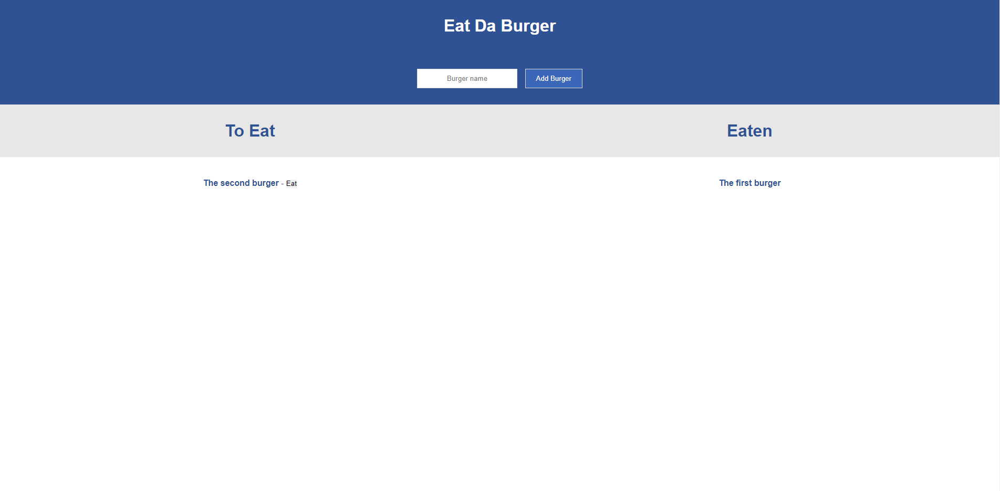

# Eat Da Burger

## Description
This web app uses a MySQL Database to store burgers that the user wants to eat and their eaten status. The user can add and eat burgers.

## Link
The application is deployed on Heroku at: <a href="https://intense-stream-16931.herokuapp.com/">https://intense-stream-16931.herokuapp.com/</a>

## Screenshots
